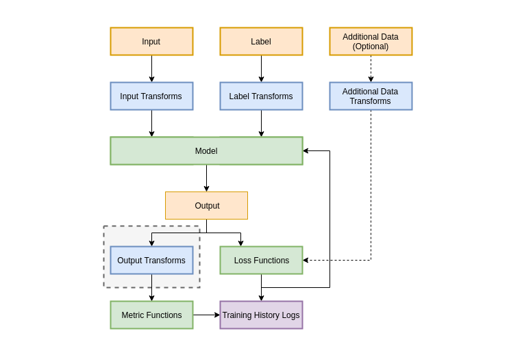
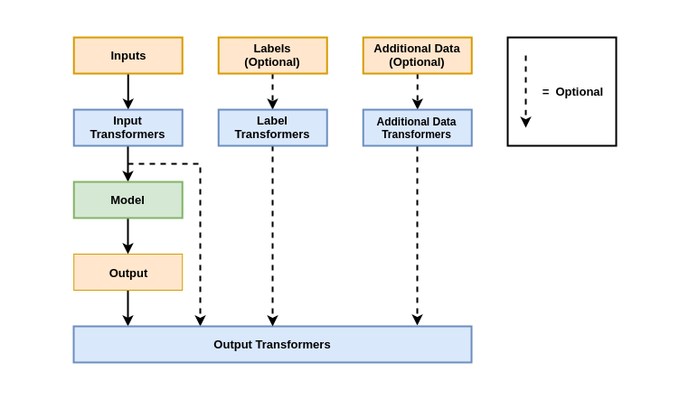

# About Deeplodocus Transformers


A Deeplodocus Transformer consists of a any number of transform functions or classes that can be applied in different ways and at different stages of the deep learning pipleine. 

Transformers can be included at the begining of your deep learning pipeline in the form of [Input Transformers](transformers.md#input-transformers), which define pre-processing and augmentation procedures for your input, labels and any additional data.  And, during the final stages of your pipeline, use [Output Transformers](transformers.md#output-transformers) to define post-processing procedures for the model outputs.

# Input Transformers

There are multiple types of input transformer to choose from:

- [Sequential Transformers](transformers.md#sequential-transformers)
- [One-of Transformers](transformers.md#one-of-transformers)
- [Some-of Transformers](transformers.md#some-of-transformers)

## Sequential Transformers

TODO

## One-of Transformers

TODO

## Some-of Transformers

TODO

## Output Transformers

The purpose of output transforms is to enable thes inclusion of post-processing algorithms, such as thresholding or non-maximum supression. 

During training, validation and testing, output tranformers can be applied to the batches of data immediately after inference by the model. Each loss receives the original (un-transformed) outputs, however the each of the metrics receives the processed outputs. This pipeline is illustrated below.



During prediction (as opposed to training, validation or testing), no losses or metrics can be included, so the output transformers become the final stage in the pipeline, which is illustrated below.



As shown in both diagrams, Output Transformers have access to not only the model outputs, but may also access the model inouts, labels and any additional data if necessary. This makes Output Transforms a powerful tool for debugging and visualising the model behaviour.

## Implementation

### As a Class

```python
class OutputTransform(object):

	def __init__(self, *args, **kwargs):
		pass
		
	def forward(self, outputs, inputs=None, labels=None, additional_data=None):
	
		# Some transformation
		
		return outputs
		
	def finish(self):
		pass
	
```

### As a Function

```python
def output_transform(outputs, inputs=None, labels=None, additional_data=None):

	# Some transformation
	
	return outputs

```

## Configuration

Output Transformers are defined by YAML files with the following structure: 

```yaml
# Output Transformer Example

name: Output Transformer		    # Name of the Transformer
transforms:
  MyTransform:					    # A unique label for the transform
    name: OutputTransform		    # The name of the transform
    module: modules.transforms	    # The module to load the transform from
    kwargs: {}   				    # Any keyword arguments
```


