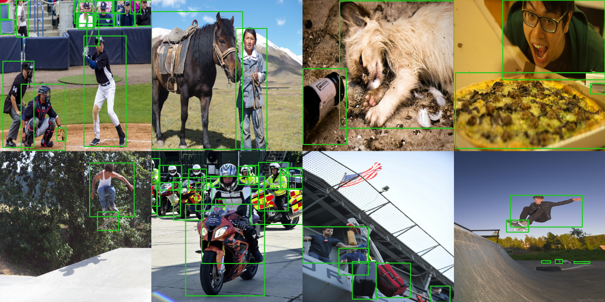
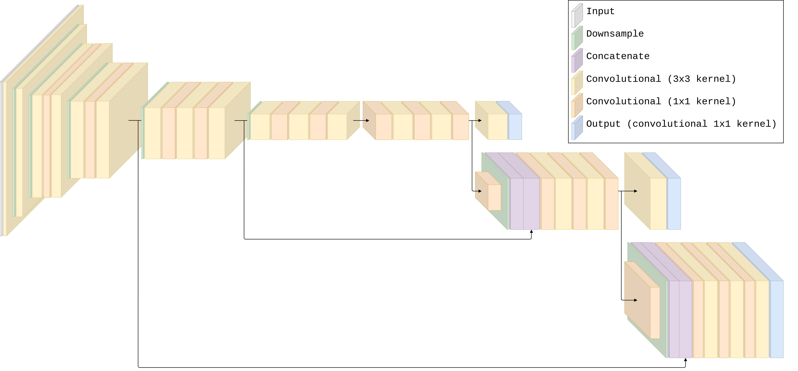
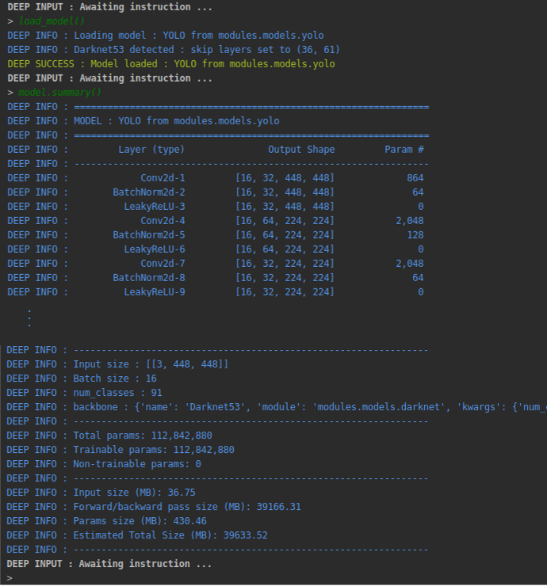
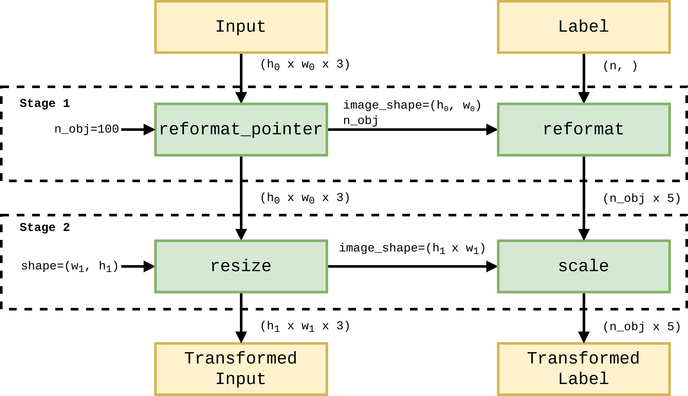

# COCO with YOLO

- Complexity: **MEDIUM**
- Computational requirement: **HIGH**

In this tutorial, we will walk through the configuration of a Deeplodocus project for object detection on the COCO dataset.
We will use the Deeplodocus implementations of YOLOv3 and its loss function, so no Python coding is required.
However, there is plenty of scope for extending this project with your own custom-build modules. 



The primary objects of this tutorial are to demonstrate how to:  

- configure the CocoDetection dataset from torchvision,
- configure YOLOv3 and its loss function and,
- process the input and label data, and YOLO outputs. 

**Prerequisite steps:**

1. [Install pycocotools](coco.md#1-install-pycocotools)
2. [Download the COCO Detection Dataset](coco.md#2-download-the-coco-detection-dataset)

**Project setup:**

1. [Initialise a New Project](coco.md#1-initialise-the-project)
2. [Data Configuration](coco.md#2-data-configuration)
3. [Model Configuration](coco.md#3-model-configuration)
4. [Loss & Metric Configuration](coco.md#4-loss-metric-configuration)
5. [Optimiser Configuration](coco.md#5-optimiser-configuration)
6. [Transformer Configuration](coco.md#6-transformer-configuration)
    - [Input Transformer](coco.md#51-input-transformer)
    - [Output Transformer](coco.md#52-output-transformer)
7. [Training](coco.md#7-training)

**Project repository:**

We recommend following each step to create this project from scratch. 
However, you can clone a copy of this project from [here](https://github.com/Deeplodocus/COCO-with-YOLO) if you'd prefer to jump ahead - but don't forget to follow the prerequisite steps. 

## Prerequisite Steps

### 1. Install pycocotools

To begin, we need the to install [pycocotools](https://github.com/cocodataset/cocoapi/tree/master/PythonAPI/pycocotools), on which the CocoDataset torchvision module is dependent. 

pycocotool requires Cython, so we'll install that first, with:

```bash
pip3 install Cython
```

Then we can install pycocotools itself with:

```bash
pip3 install pycocotools
```

### 2. Download the COCO Detection Dataset

Secondly, let's download the appropriate data from the [COCO website](http://cocodataset.org/).

Specifically, we need the following items: 

- 2017 Train images [download [18GB]](http://images.cocodataset.org/zips/train2017.zip)
- 2017 Val images [download [1GB]](http://images.cocodataset.org/zips/val2017.zip)
- 2017 Train/Val annotations [download [241MB]](http://images.cocodataset.org/annotations/annotations_trainval2017.zip)

When you have initialised your Deeplodocus project, we can extract each of these into the data folder. 

## 1. Initialise the Project

Initialise a new Deeplodocus project in your terminal with:

```bash
deeplodocus new-project COCO-with-YOLO
```

After initialising your project extract the COCO dataset into the data directory of the empty project.
The resultant structure should look like this: 

```text
data
├─  annotations
│	├─  instances_train2017.json
│	└─  instances_val2017.json
├─  train2017
│	├─  000000000???.jpg
│	├─  000000000???.jpg
│	└─  ...
└─  val2017
    ├─  000000000???.jpg
    ├─  000000000???.jpg
    └─  ...
```

## 2. Data Configuration

Open up the **config/data.yaml** file, and let's get started. 
    
### 2.2. Data loader    

At the top of the file you'll see the entry for **dataloader**, use this to set the batch size and the number of workers. 
If you have limited GPU memory, you may need to reduce your batch size.

```yaml
dataloader:
  batch_size: 12  # Possible batch sizes will depend on the available memory
  num_workers: 8  # This will depend on your CPU, you probably have at least 4 cores
```
### 2.3. Enable the required pipelines

Next, use the **enabled** entry to enable different types of pipeline. 
As we only have training and validation data in this case, we need to enable just the trainer and validator as follows:

```yaml
enabled:
  train: True  # Enable the trainer
  validation: False  # Enable the validator
  test: False  # There is no test data
  predict: False  # There is no prediction data
```

### 2.4. Configure the dataset

Finally, we arrive at the **datasets** entry.
We define this with a list of two items, which configure the training and validation portions of the dataset respectively. 
We'll start with the first item - training data - which is shown below.

Within the training portion we define two entries, one for input and one for label and for each entry, we define a single data source. 
    
```yaml
datasets:
  # Training portion
  - name: COCO Train 2017  # Human-readable name
    type: train  # Dataset type (train/validation/test/predict)
    num_instances: Null  # Number of instances to use (Null = use all)
    entries:
      # Input Entry
      - name: COCO Image  # Human-readable name
        type: input  # Entry type (input/label/additional data)
        load_as: image  # Load data as image
        convert_to: float32  # Convert to float32
        move_axis: [2, 0, 1]  # Permute : (h x w x ch) to (ch x h x w)
        enable_cache: True  # Give other entries access to this entry
        # We define one source for this entry - CocoDetection from torchvision.datasets
        sources:
          - name: CocoDetection
            module: torchvision.datasets
            kwargs:
              root: data/train2017  # Path to training image directory
              annFile: data/annotations/instances_train2017.json  # Training annotations
      # Label Entry
      - name: COCO Label  # Human-readable name
        type: label  # Entry type (input/label/additional data)
        load_as: given  # Do not use any additional methods on loading
        convert_to: float32  # Convert to float32 (after data transforms)
        move_axis: Null  # No need for move axis
        enable_cache: False  # No other entries need access to this data
        # Define one source for this entry - point to data from the input entry
        sources:
          - name: SourcePointer   # Point to an existing data source
            module: Null  # Import from default modules
            kwargs:
              entry_id: 0  # Take data from the first entry (defined above)
              source_id: 0  # Take from the first (and only) source
              instance_id: 1  # Take the second item - the label
```

!!! note "Why are we using a SourcePointer?"
    When using torchvision datasets, the input and label entries are loaded together in a single iterable. 
    This does not change how we configure the input source.
    However, for the label source, we use a SourcePointer to reference the second item from the first (and only) source of the first (input) entry. 

Now, we can include the validation configurations, which will look very similar. 
There are only 4 differences: 

1. dataset **name**
2. dataset **type**
3. input entry source **root**
4. input entry source **annFile**

Validation dataset configurations: 

```yaml
  # Validation portion
  - name: COCO Val 2017  # Human-readable name
    type: validation  # Dataset type (train/validation/test/predict)
    num_instances: Null  # Number of instances to use (Null = use all)
    entries:
      # Input
      - name: COCO Image  # Human-readable name
        type: input  # Entry type (input/label/additional data)
        load_as: image  # Load data as image
        convert_to: float32
        move_axis: [2, 0, 1]  # Permute : (h x w x ch) to (ch x h x w)
        enable_cache: True  # Give other entries access to this entry
        # We define one source for this entry - CocoDetection from torchvision.datasets
        sources:
          - name: CocoDetection
            module: torchvision.datasets
            kwargs:
              root: data/val2017  # Path to val image directory
              annFile: data/annotations/instances_val2017.json  # Validation annotations
      # Label
      - name: COCO Label  # Human-readable name
        type: label  # Entry type (input/label/additional data)
        load_as: given  # Do not use any additional methods on loading
        convert_to: float32  # Convert to float32
        move_axis: Null  # No need for move axis
        enable_cache: False  # No other entries need access to this data
        sources:
          - name: SourcePointer   # Point to an existing data source
            module: Null  # Import from default modules
            kwargs:
              entry_id: 0  # Take data from the first entry (defined above)
              source_id: 0  # Take from the first (and only) source
              instance_id: 1  # Take the second item - the label
``` 

## 3. Model Configuration

We'll use Deeplodocus' implementation of the YOLOv3 architecture for this project, which can be used with different backbone feature detectors.

Our source code for [YOLO](https://github.com/Deeplodocus/deeplodocus/blob/master/deeplodocus/app/models/yolo.py) and [Darknet](https://github.com/Deeplodocus/deeplodocus/blob/master/deeplodocus/app/models/darknet.py) can be found on GitHub, and YOLOv3 with a Darknet-19 backbone is illustrated below. 





Open and edit the **config/model.yaml**  as follows to specify the object detector.

```yaml
name: YOLO                              # Select YOLO
module: deeplodocus.app.models.yolo     # From the deeplodocus app
from_file: False                        # Don't try to load from file
file: Null                              # No need to specify a file to load from
input_size:                             # Specify the input size
  - [3, 448, 448]                     
kwargs:                                 # Keyword arguments for the model class
  num_classes: 91                       # Number of classes in COCO
  backbone:                             # Specify the backbone
    name: Darknet53                     # Select Darknet53 (Darknet19 is also available)
    module: deeplodocus.app.models.darknet      # Point to the darknet module
    kwargs:                                     # Keyword arguments for the backbone  
      num_channels: 3                           # Tell it to expect an input with 3 channels 
      include_top: False                        # Don't include the classifier
```

That's it! 
YOLO is configured and ready to go. 

You should now be able to load the model and print a summary, like this: 



!!! note "Want to know more about YOLO?"
    For an in-depth understanding of the network architecture, we strongly recommend reading the YOLO papers:
    
    1. [You Only Look Once: Unified Real-Time Object Detection](https://arxiv.org/pdf/1506.02640.pdf)
    2. [YOLO9000: Better, Faster, Stronger](https://arxiv.org/pdf/1612.08242.pdf)
    3. [YOLOv3: An Incremental Improvement](https://pjreddie.com/media/files/papers/YOLOv3.pdf)
        
## 4. Loss & Metric Configuration

### 4.1. Losses

To train our YOLO object detector, we need to configure a loss function. 

We can specify Deeplodocus' implementation of the YOLO loss function by editing the **config/losses.yaml** file as follows: 

```yaml
YOLOLoss:
  name: YOLOLoss  # Name of the loss object
  module: deeplodocus.app.losses.yolo  # Import from deeplodocus app
  weight: 1  # Multiplier for loss function
  kwargs:
    iou_threshold: 0.5
    # Weights applied to cells that do not contain and object and cells that do contain an object respectively
    obj_weight: [0.5, 1]
    # Multiplier applied to loss from coordinate predictions
    box_weight: 5
    # Options: Null (no weights), auto, list weight values (w0, w1, ..., wn)
    # Auto:  total / frequency * num_classes
    class_weight: Null
    # Sets a minimum class weight (may be useful when class  are very imbalanced)
    min_class_weight: Null
```

We have done our best to implement this loss function as described in the literature, the source code is published [here](https://github.com/Deeplodocus/deeplodocus/blob/master/deeplodocus/app/losses/yolo.py).

### 4.2. Metrics

Currently, Deeplodocus does not include any of the traditional metrics for evaluating object detection.
Unless you wish to include you own metrics, make sure that the **config/metrics.yaml** file is empty. 

## 5. Optimiser Configuration

Have a look at the optimiser configurations specified in **config/optimizer.yaml**.
By default we have specified the Adam optimiser from [torch.optim](https://pytorch.org/docs/stable/optim.html).
The learning rate is specified by **lr**, and additional parameters can also be given.  

```yaml
name: "Adam"
module: "torch.optim"
kwargs:
  lr: 0.0001
  betas: [0.9, 0.999]
  weight_decay: 0
```

!!! note 
    Make sure the learning rate is not too high, otherwise training can become unstable. 
    If you are able to use a pre-trained backbone, a learning rate of 1e-3 should be just fine. 
    However, if you are training from scratch - like in this tutorial - a lower learning rate will be necessary in the beginning. 
    
## 6. Transformer Configuration

The final step is the configuration of two data transformers:

1. An input transformer to pre-process images and labels before they are given to the network.
2. An output transformer for post-processing and visualisation. 

Edit the **config/transform.yaml** file as follows: 

```yaml
train:
  name: Train Transform Manager
  inputs:
    - config/transformers/input.yaml  # Path to input transformer
  labels:
    - '*inputs:0'  # Point to the first input transformer
  additional_data: Null
  outputs:
    - config/transformers/output.yaml  # Path to output transformer
validation:
  name: Validation Transform Manager
  inputs:
    - config/transformers/input.yaml  # Path to input transformer
  labels:
    - '*inputs:0'  # Point to the first input transformer
  additional_data: Null
  outputs:
    - config/transformers/output.yaml  # Path to output transformer
test:
  name: Test Transform Manager
  inputs: Null
  labels: Null
  additional_data: Null
  outputs: Null
predict:
  name: Predict Transform Manager
  inputs: Null
  additional_data: Null
  outputs: Null
```

!!! note "Why does the label transformer point to the input transformer?"
    COCO images are different sizes, therefore each must be resized before being concatenated into a batch.
    To keep the bounding boxes labels relevant, we need to normalise them by the width and height of their associated image before it is resized. 
    Therefore, each label transformer should point to the input transformer, thus each label transform will be dependant on transform applied to its corresponding image.
 
### 5.1. Input Transformer

We now need to setup a transformer that defines the sequence of functions to apply to the inputs and labels. 
Open the **config/transformers/input.yaml** file and edit as follows: 

```yaml
method: sequential
name: Transformer for COCO input
mandatory_transforms_start:
  - format_labels:
      name: reformat_pointer
      module: deeplodocus.app.transforms.yolo.input
      kwargs:
        n_obj: 100
  - resize:
      name: resize
      module: deeplodocus.app.transforms.yolo.input
      kwargs:
        shape: [416, 416]
transforms: Null
mandatory_transforms_end: Null
```

These two transforms constitute the two stages of the transformer pipeline illustrated below:




**Stage 1:**

In the first stage, the label is formatted into an array of size (n_obj x 5) and the box coordinates are normalised by the corresponding image shape.
    
- An input (image) is given to the **[reformat_pointer](https://github.com/Deeplodocus/deeplodocus/blob/master/deeplodocus/app/transforms/yolo/input.py)** function, which returns:
    - the image (unchanged) and,
    - a **TransformData** object that stores the shape of the given image and another transform function, **[reformat](https://github.com/Deeplodocus/deeplodocus/blob/master/deeplodocus/app/transforms/yolo/label.py)**.
- As the label transformer points to the input transformer, the label will inputted to the function specified by this **TransformData** object, which:
    - formats the label into a numpy array and,
    - normalises the box coordinages w.r.t the given image shape. 
   
**Stage 2:**

In the second stage, the input image to the given shape and box coordinates of the corresponding label are scaled accordingly. 
    
- The image is inputted to the **[resize](https://github.com/Deeplodocus/deeplodocus/blob/master/deeplodocus/app/transforms/yolo/input.py)** function, which returns:
    - the image, resized to (448 x 448) and,
    - a **TransformData** object that points to an **[scale](https://github.com/Deeplodocus/deeplodocus/blob/master/deeplodocus/app/transforms/__init__.py)** transformer function.
- The label is given to the **[scale](https://github.com/Deeplodocus/deeplodocus/blob/master/deeplodocus/app/transforms/__init__.py)** transform.
    - This sales up the label box coordinates by the new shape of the image.
    
### 5.2. Output Transformer

To visualise the outputs of our YOLO model during training or validation, we can apply some post-processing transforms. 
To do this, we need to initialise an output transformer configuration file. 

Navigate to the **config/transformers** directory and use the command:

```bash
deeplodocus output-transformer output.yaml
```
This will create a new configuration file that you can open and edit to look like this: 

```yaml
# Define skip - for use in multiple transforms
# A skip of 20 will cause the transforms to only process every 25th batch
skip: &skip
  25

# Sometimes there can be lots of false detections at the beginning of training
# This can slow things down
# Use initial skip to skip the first few batches of the first epoch
initial_skip: &initial_skip
  0

name: Output Transformer
transforms:
  Activate:
    name: Activate
    module: deeplodocus.app.transforms.yolo.output
    kwargs:
      skip: *skip
      initial_skip: *initial_skip
  NonMaximumSuppression:
    name: NMS
    module: deeplodocus.app.transforms.yolo.output
    kwargs:
      iou_threshold: 0.5  # IoU threshold for NMS
      obj_threshold: 0.5  # Threshold for suppression by objectness score
      skip: *skip
      initial_skip: *initial_skip
  Visualization:
    name: Visualize
    module: deeplodocus.app.transforms.yolo.output
    kwargs:
      obj_threshold: 0.5  # Objectness threshold
      key: data/key.txt  # Key of object class names
      rows: Null  # No. of rows when displaying images (Null = auto)
      cols: Null  # No. of cols when displaying images (Null = auto)
      scale: 0.6  # Re-scale the images before displaying
      wait: 1  # How long to wait (ms) (0 = wait for a keypress)
      width: 2  # Line width for drawing boxes
      lab_col: [32, 200, 32]  # Color for drawing ground truth boxes (BGR)
      det_col: [32, 32, 200]  # Color for drawing model detections (BGR)
      font_thickness: 2
      font_scale: 0.8
      skip: *skip
      initial_skip: *initial_skip
```

This transformer specifies three output transform functions: 

1. Activate - applies activation functions to the model outputs
2. NonMaximumSuppression - removes duplicate predictions
3. Visualization - displays the ground truth and predictions

The source code for each of these transform functions can be found [here](https://github.com/Deeplodocus/deeplodocus/blob/master/deeplodocus/app/transforms/yolo/output.py).

## 7. Training

Now you're good to go! You can now run the project main file, and use the commands **load()** and **train()**.

A useful series of commands can be found (commented out) under the **on_wake** entry in **config/project.yaml**
