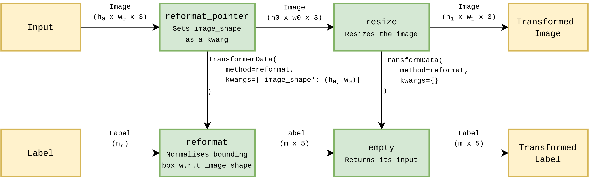

# COCO Object Detection with YOLOv3

In this tutorial, we will walk through each step of configuring a Deeplodocus project for object detection on the COCO dataset with an implementation of YOLOv3.

Alternatively, you can follow just the prerequisite steps, clone the project from [here](https://github.com/Deeplodocus/COCO-with-YOLO), and get started right away!

## Prerequisite Steps

### 1. Download the COCO detection dataset

First of all, let's download the appropriate data from the [COCO website](http://cocodataset.org/).

Specifically, we need the following items: 

- 2017 Train images [download [18GB]](http://images.cocodataset.org/zips/train2017.zip)
- 2017 Val images [download [1GB]](http://images.cocodataset.org/zips/val2017.zip)
- 2017 Train/Val annotations [download [241MB]](http://images.cocodataset.org/annotations/annotations_trainval2017.zip)

When you have initialised your Deeplodocus project, extract each of these into the data folder. 

### 2. Install pycocotools

We also need the to install [pycocotools](https://github.com/cocodataset/cocoapi/tree/master/PythonAPI/pycocotools), on which the CocoDataset torchvision module is dependent. 

pycocotool requires Cython, so we'll install that first, with:

```pip3 install Cython```

Then we can install pycocotools itself with:

```pip3 install pycocotools```

## Let's Begin

### 1. Initialise  

Initialise a new Deeplodocus project in your terminal with:

```deeplodocus new-project COCO-with-YOLO```

### 2. Dataset 

Quickly make sure the dataset is in the right place.
After initialising your project and extracting COCO, the data file in your project should look like this: 

```
data
├─  annotations
│	├─  instances_train2017.json
│	└─  instances_val2017.json
├─  train2017
│	├─  000000000000.jpg
│	├─  000000000001.jpg
│	└─  ...
└─  val2017
    ├─  000000000000.jpg
    ├─  000000000001.jpg
    └─  ...
```

### 2. Data Configurations

Setting up the data configurations is one of most complicated steps in this project - but bare with me, we'll soon be efficiently loading COCO and feeding it to our data-hungry network. 

Open up the `config/data.yaml` file and let's get started. 

At the top of the file you'll see the entry for `dataloader`, within which we can set the batch size and the number of workers. 
Edit these to best fit your computational resources. 
    
```yaml
dataloader:
  batch_size: 32        # Possible batch sizes will depend on the available memory 
  num_workers: 4        # This will depend on your CPU, you probably have at least 4 cores
```

Next, we have entry for enabling different types of pipeline. 
In this case, we only have training and validation data, so set train and validation to `True` and the remaining options to `False`.

```yaml
enabled:
  train: True           # Enable the trainer
  validation: False     # Enable the validator
  test: False           # There is no test data
  predict: False        # There is no prediction data
```

Finally, we can configure the dataset itself. 
In this case, the first item in the datasets list configures the data for training.

```yaml
datasets:    
  # Let's start with the training portion of the dataset...
  - name: COCO Train 2017               # Human-readable name
    type: train                         # Dataset type (train/validation/test/predict)
    num_instances: Null                 # Number of instances to use (Null = use all)
    entries:                            # Define the inputs and labels
      # Input
      - name: COCO Image                  # Give the entry a name
        type: input                       # This entry is an input
        load_as: image                    # Treat the given data as an image
        convert_to: float32               # Convert to float32 (after data transforms)
        move_axis: [2, 0, 1]              # Go from (h x w x ch) to (ch x h x w) - torch convention
        enable_cache: True                # Give the label entry access to the data in this entry
        sources:                          # Define where this data will come from
          - name: CocoDetection             # Use the existing CocoDetection data source
            module: torchvision.datasets    # Import this from torchvision.datasets
            kwargs:                         
              root: data/train2017          # Path to directory of training images
              annFile: data/annotations/instances_train2017.json    # Path to file of training annotations 
      # Label
      - name: COCO Label                  # Human-readable name
        type: label                       # This entry is a label
        load_as: given                    # Leave the data type alone 
        convert_to: float32               # Convert to float32 (after data transforms)
        move_axis: Null                   # N/A
        enable_cache: False               # No other entries need access to this data
        sources:
          - name: SourcePointer             # Point to an existing data source
            module: Null                    # Import from default modules
            kwargs:
              entry_id: 0                   # Take data from the first entry (defined above)
              source_id: 0                  # Take from the first (and only) source
              instance_id: 1                # Take the second item - the label
```

The second item, configures the validation portion of the data. 

```yaml
  # Validation dataset - define in much the same way, only the dataset name and sources are different
  - name: Validation MNIST
    type: validation
    num_instances: Null
    entries:
      # Input
      - name: COCO Image
        type: input
        load_as: image
        convert_to: float32
        move_axis: [2, 0, 1]
        enable_cache: True
        sources:
          - name: COCODetection
            module: torchvision.datasets
            kwargs:
              root: data/val2017
              annFile: data/annotations/instances_val2017.json
      # Label
      - name: COCO Label
        type: label
        load_as: given
        convert_to: float32
        move_axis: Null
        enable_cache: False
        sources:
          - name: SourcePointer 
            module: Null
            kwargs:
              entry_id: 0           
              source_id: 0          
              instance_id: 1   
``` 

### 3. Model Configuration

Next, we can configure the `config/model.yaml` file to specify the object detector. 

```yaml
name: YOLO                                  # Select YOLO
module: deeplodocus.app.models.yolo         # From the deeplodocus app
from_file: False                            # Don't try to load from file
file: Null                                  # No need to specify a file to load from
input_size:                                 # Specify the input size (optional) used by model.summary()
  - [3, 512, 512]                     
kwargs:                                     # Keyword arguments for the model class
  num_classes: 91                             # Number of classes in COCO
  backbone:                                   # Specify the backbone
    name: Darknet53                             # Select Darknet53 (Darknet19 is also available)
    module: deeplodocus.app.models.darknet      # Load from the deeplodocus app
    kwargs:                                     # Keyword arguments for the backbone  
      num_channels: 3                           # Tell it to expect an input with 3 channels 
      include_top: False                        # Don't include the classifier
```

### 4. Loss Function Configuration

Edit the `config/losses.yaml` file to configure the loss functions for YOLO.

The loss function is split into three components which relate to the objectness score, bounding box coordinates and object classifications respectively. 

```yaml
ObjectLoss:
  name: ObjectLoss
  module: deeplodocus.app.losses.yolo
  weight: 1
  kwargs:
    iou_threshold: 0.5
    obj_weight: 10
BoxLoss:
  name: BoxLoss
  module: deeplodocus.app.losses.yolo
  weight: 1
  kwargs:
    iou_threshold: 0.5
ClassLoss:
  name: ClassLoss
  module: deeplodocus.app.losses.yolo
  weight: 1
  kwargs: {}
```

### 5. Data Transforms

Next, we need to configure the data transforms that will be applied before the input to the network, and at the network output. 

Edit the `config/transform.yaml` file as follows: 

```yaml
train:
  name: Train Transform Manager
  inputs:
    - config/transformers/input.yaml      # Input transformer
  labels:
    - '*inputs:0'                         # Point to the first input transformer
  additional_data: Null
  outputs:
    - config/transformers/output.yaml     # Output transformer
validation:
  name: Validation Transform Manager
  inputs:
    - config/transformers/input.yaml      # Input transformer
  labels: 
    - '*inputs:0'                         # Point to the first input transformer
  additional_data: Null
  outputs: 
    - config/transformers/output.yaml     # Output transformer
test:
  name: Test Transform Manager
  inputs: Null
  labels: Null
  additional_data: Null
  outputs: Null
predict:
  name: Predict Transform Manager
  inputs: Null
  additional_data: Null
  outputs: Null
```

Notice that the label transformers each point to the input transformer. 
This is because the COCO images are different sizes and need to be resized before being concatenated into batches for the network.
Because of this, we need to normalise the bounding box labels by the width and height of their respective image. 





In this current configuration, the transforms functions applied in the validation pipeline will the same as those for the training pipeline. 


#### 5.1. Input Transformer

#### 5.2, Output Transformer


